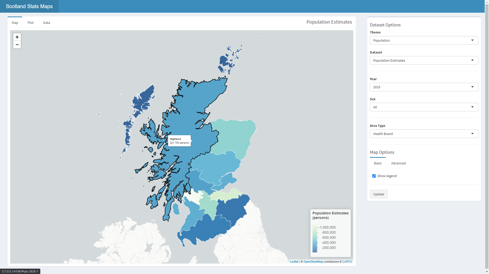

# Scotland Stats Maps

This interactive dashboard generates informative maps by marrying datasets - 
available from [statistics.gov.scot](https://statistics.gov.scot/home) - with
their respective datazones.

## Background and Objectives

Many of the datasets provided by:

+ [Accountant in Bankruptcy](https://www.aib.gov.uk/)
+ [Care Inspectorate](https://www.careinspectorate.com/)
+ [National Records of Scotland](https://www.nrscotland.gov.uk/)
+ [Public Health Scotland](https://publichealthscotland.scot/)
+ [Registers of Scotland](https://www.ros.gov.uk/)
+ [Revenue Scotland](https://www.revenue.scot/)
+ [Scottish Fire and Rescue Service](https://www.firescotland.gov.uk/)
+ [Scottish Government](https://www.gov.scot/)
+ [Scottish Natural Heritage](https://www.nature.scot/)
+ [Scottish Environmental Protection Agency](https://www.sepa.org.uk/)
+ [Transport Scotland](https://www.transport.gov.scot/)
+ [VisitScotland](https://www.visitscotland.com/)

which have been collated by:
[statistics.gov.scot](https://statistics.gov.scot/home) contain features with
an area code. The objective of Scotland Stats Maps is to display as much of this
information as possible in one interactive dashboard.

## Usage

The dashboard is a Shiny application written in R, using RStudio. 

To use view and use the app,

+ clone this repository
+ open RStudio
+ open the local project file: scot_stats_dashboard.Rproj

The ui, server and global are located in the top directory. Navigate to one
while in RStudio and click `Run App` located at the top right.

To use the ui, first select a dataset theme (e.g. Population), and then a
specific dataset (e.g. Population Estimates). The interface will react to these
inputs and generate the next possible Inputs. Select desired values and press
`Update` to update the map as well as the basic bar plot on the adjacent tab. To
view the data behind the results: navigate to the data tab.

## Contribution Guidelines

## Packages Used

|package|used_in|version|
|-|-|-|
|shiny|app|1.6.0|
|shinydashboard|app|0.7.1|
|readr|app|1.4.0|
|dplyr|app|1.0.2|
|stringr|app|1.4.0|
|purrr|app|0.3.4|
|rgdal|app|1.5-23|
|leaflet|app|2.0.4.1|
|ggplot2|app|3.3.2|
|assertthat|app|0.2.1|
|rlist|app|0.4.6.1|
|RColorBrewer|app|1.1-2|
|janitor|both|2.1.0|
|tidyverse|cleaning|1.3.0|

