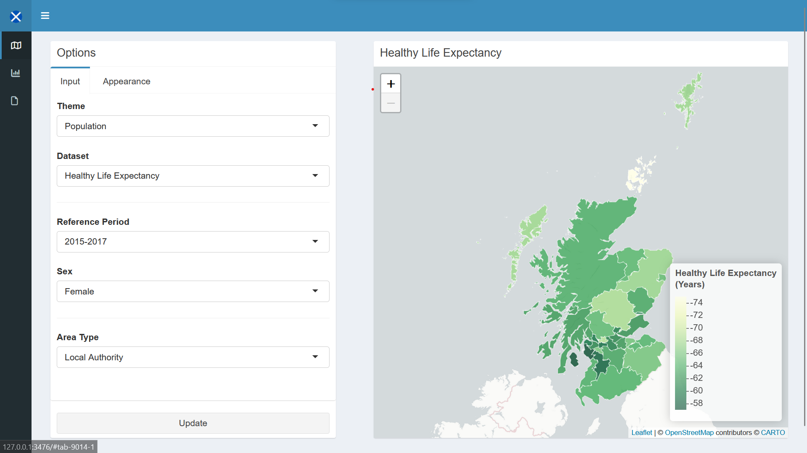

# Scotland Stats Maps

This interactive dashboard generates informative maps by marrying datasets - 
available from [statistics.gov.scot](https://statistics.gov.scot/home) - with
their respective datazones.

## Background and Objectives

## Usage

The dashboard is written in R, using RStudio and R Shiny. 

To use view and use the app,

+ clone this repository

The ui, server and global are located in the top directory. Navigate to one
while in RStudio and click `Run App` located at the top right.

To use the ui, first select a dataset theme (e.g. Population), and then a
specific dataset (e.g. Population Estimates). The interface will react to these
inputs and generate the next possible Inputs. Select desired values and press
`Update` to update the map as well as the basic bar plot on the adjacent tab. To
view the data behind the results: navigate to the data tab.

## Contribution Guidelines

## Packages Used

